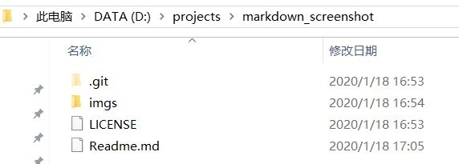
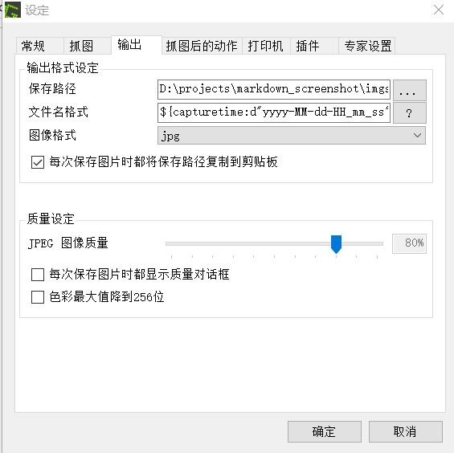
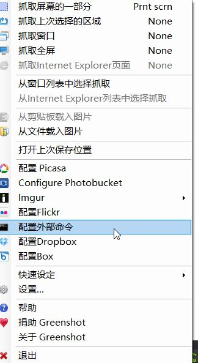
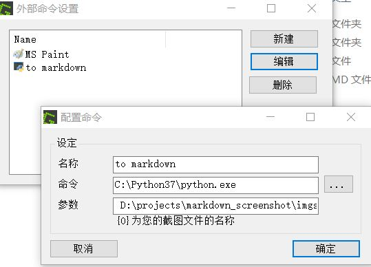
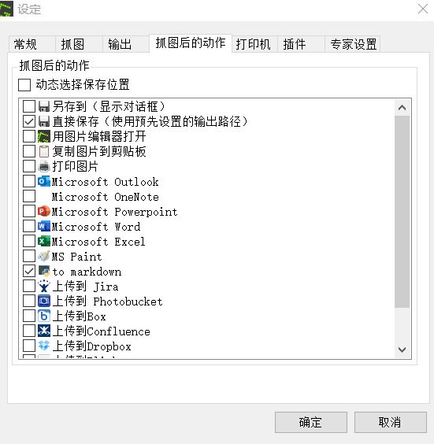
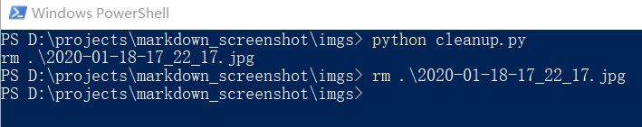

## markdown截图辅助脚本

用markdown记笔记最大的好处就是记笔记格式不乱，截图太麻烦写了个脚本。

适用于windows，暂未适配linux。

建议把所有的图片都放到imgs文件夹，当然也可以所有的markdown共用一个imgs文件夹。

`clip.py`用于写markdown时快速插入。它提取传入参数的文件名字，并转换成markdown可以用的格式，然后复制到剪贴板。需要配合其它的截图软件使用。

`cleanup.py`可以检测markdown中没有用到的图片，方便删除。一开始定义了两个变量`image_path`和`markdown_path`。执行后会扫描`image_path`中的`.png`或`.jpg`后缀的文件，同时会扫描`markdown_path`中所有`.md`结尾的文件，用正则`!\[[^\]]*\]\(([^\)]+)\)`去找类似于``这样的图像引用，会列出所有没有被引用到的图片的文件名字。

## 配置
我用的截图软件是[Greenshot](https://github.com/greenshot/greenshot/releases)。

当前工程是`markdown_screenshot`，位于`D:/projects/markdown_screenshot`目录：


下面这些设定是必须的：
#### 文件存储路径
- 保存路径设置`D:\projects\markdown_screenshot\imgs`，也就是`imgs`文件夹所在路径。
- 文件名格式`${capturetime:d"yyyy-MM-dd-HH_mm_ss"}`，这个可以任意写，但默认的输出格式中有空格，`${title}`也可能出现中文，这对markdown渲染的软件不友好，请避免。如果您不知道如何设置，请直接复制我的字符串。

#### 添加Greenshot对clip.py的引用
这可以让Greenshot截图完成后直接将markdown文本复制到剪贴板上。
- 右键点击托盘图标的`配置外部命令`

- 添加一个新的外部命令设置，启动程序为python的主程序，**请根据您的环境自行设置**，参数包含clip.py脚本和图片文件名。这里我的设定名称`to markdown`，命令`C:\Python37\python.exe`，参数` D:\projects\markdown_screenshot\imgs\clip.py "{0}"`。这里的`clip.py`的路径并不需要根据不同的项目去切换。


#### 修改抓图后的动作
勾选`直接保存（使用预先设置的输出路径）`和`to markdown`，不要`动态选择保存位置`。


## 截图
直接截图即可，在markdown中粘贴就是一个图片。
## 清理
有些图片截取后后悔了，可以直接在markdown中删除，最后使用`cleanup.py`自动检测没有用到的图片并删除。
在`imgs`目录中执行
```sh
python cleanup.py
```
为了安全考虑，`cleanup.py`并不会直接删除文件，而是提供一条删除文件的指令，您需要自行复制这条指令执行。


为了和shell兼容，使用了windows powershell同样支持的rm指令。在cmd下，你应该把`rm`改成`del`。